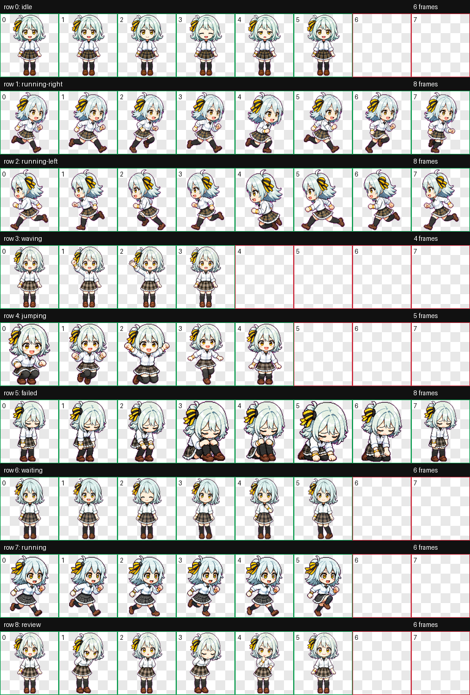

# Koyanagi Kaho Codex Pet

Fan-made animated pet for the Codex desktop app.

## Preview



| Idle | Waiting | Review | Run |
| --- | --- | --- | --- |
|  |  |  |  |

Full MP4 previews live in `previews/koyanagi-kaho/videos/`.

## Install

Install manually:

```bash
mkdir -p ~/.codex/pets
cp -R pets/koyanagi-kaho ~/.codex/pets/
```

On Windows PowerShell:

```powershell
$dest = Join-Path $env:USERPROFILE ".codex\pets\koyanagi-kaho"
New-Item -ItemType Directory -Force -Path (Split-Path $dest) | Out-Null
Remove-Item -LiteralPath $dest -Recurse -Force -ErrorAction SilentlyContinue
Copy-Item -LiteralPath ".\pets\koyanagi-kaho" -Destination $dest -Recurse
```

Then restart Codex Desktop or refresh the pet selector, and choose `Koyanagi Kaho`.

## Files

```text
pets/koyanagi-kaho/
  pet.json
  spritesheet.webp
previews/koyanagi-kaho/
  contact-sheet.png
  gifs/
  videos/
catalog.json
scripts/
```

## Validate

```bash
python scripts/validate_catalog.py
```

Expected result:

```text
catalog ok: 1 pet(s)
```
