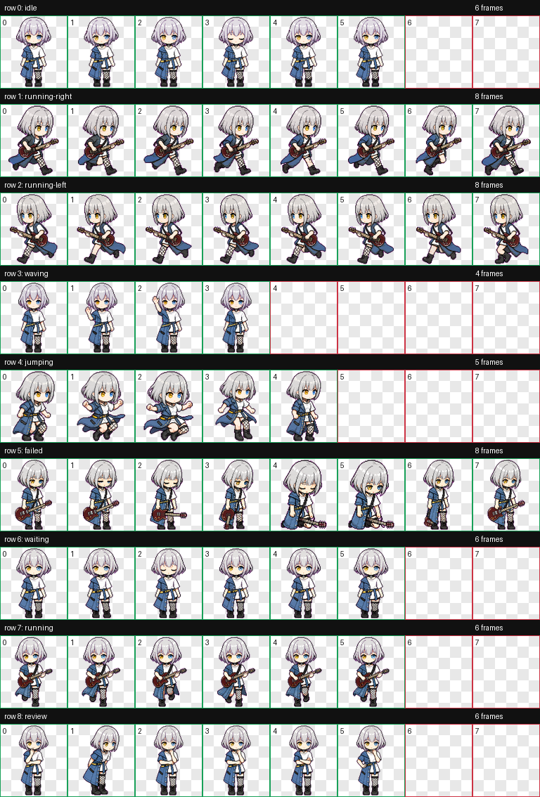

# Codex Pets

Fan-made animated pets for the Codex desktop app.

## Pets

### Koyanagi Kaho


### Rana



## Install

Install one pet manually:

```bash
mkdir -p ~/.codex/pets
cp -R pets/rana ~/.codex/pets/
```

On Windows PowerShell:

```powershell
$pet = "rana"
$dest = Join-Path $env:USERPROFILE ".codex\pets\$pet"
New-Item -ItemType Directory -Force -Path (Split-Path $dest) | Out-Null
Remove-Item -LiteralPath $dest -Recurse -Force -ErrorAction SilentlyContinue
Copy-Item -LiteralPath ".\pets\$pet" -Destination $dest -Recurse
```

Use `$pet = "koyanagi-kaho"` to install Koyanagi Kaho instead.

Then restart Codex Desktop or refresh the pet selector.

## Files

```text
pets/
  koyanagi-kaho/
    pet.json
    spritesheet.webp
  rana/
    pet.json
    spritesheet.webp
previews/
  koyanagi-kaho/
  rana/
catalog.json
scripts/
```

## Validate

```bash
python scripts/validate_catalog.py
```

Expected result:

```text
catalog ok: 2 pet(s)
```
